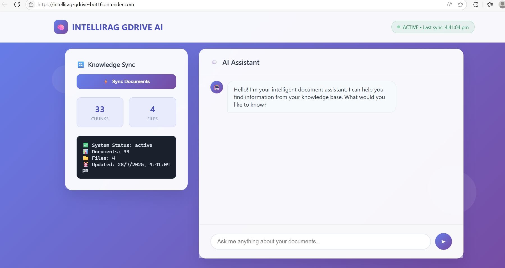
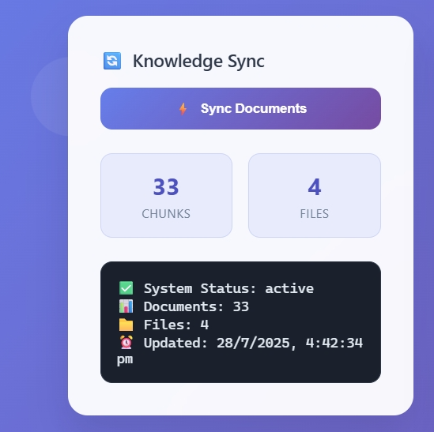

# IntelliRAG - AI-Powered Document Assistant

A production-ready Retrieval-Augmented Generation (RAG) chatbot that intelligently searches and answers questions from your Google Drive documents using Google Gemini-1.5-flash and Qdrant vector database.

[](https://intellirag-gdrive-bot16.onrender.com)
[](https://www.docker.com/)
[](https://opensource.org/licenses/MIT)

## Overview

IntelliRAG transforms how you interact with your document collections by providing AI-powered search and question-answering capabilities. Simply connect your Google Drive, sync your documents, and start asking questions to get contextual, accurate answers.

> 🚀 **Live App Available at:**  
> 🌐 [https://intellirag-gdrive-bot16.onrender.com](https://intellirag-gdrive-bot16.onrender.com)

### Key Capabilities

- **Intelligent Document Search**: Advanced vector search through your Google Drive documents
- **AI-Powered Responses**: Contextual answers generated using Google Gemini-1.5-flash
- **One-Click Synchronization**: Seamless document syncing from Google Drive to vector database
- **Production Ready**: Fully containerized with Docker and optimized for cloud deployment
- **Real-time Processing**: Instant document indexing and query processing

## Architecture

### Technology Stack

| Component | Technology |
|-----------|------------|
| **Backend Framework** | Flask (Python) |
| **Language Model** | Google Gemini-1.5-flash |
| **Vector Database** | Qdrant Cloud |
| **Document Processing** | LangChain + Unstructured |
| **Embeddings** | Sentence Transformers (paraphrase-MiniLM-L6-v2) |
| **Frontend** | HTML5, CSS3, JavaScript |
| **Containerization** | Docker |
| **Deployment** | Render (configurable for other platforms) |

### System Flow

1. **Document Ingestion**: Google Drive documents are automatically processed and chunked
2. **Vector Embedding**: Text chunks are converted to high-dimensional vectors using sentence transformers
3. **Storage**: Vectors are stored in Qdrant with metadata for efficient retrieval
4. **Query Processing**: User queries are embedded and matched against the vector database
5. **Response Generation**: Retrieved context is sent to Gemini-1.5-flash for answer synthesis

## Quick Start

### Cloud Deployment (Recommended)

1. **Fork this repository** to your GitHub account

2. **Set up your environment variables** (see Configuration section below)

3. **Deploy on Render**:
   - Visit [Render](https://render.com/) and create a new Web Service
   - Connect your forked repository
   - Configure deployment settings:
     ```
     Runtime: Docker
     Start Command: gunicorn --bind 0.0.0.0:5000 api:app
     Environment: Python 3.11
     ```

4. **Access your deployment** at the provided Render URL

### Local Development

```bash
# Clone the repository
git clone https://github.com/MICHAEL-MARIA16/INTELLIRAG-GDRIVE_BOT.git
cd intellirag

# Create virtual environment
python -m venv venv
source venv/bin/activate  # Windows: venv\Scripts\activate

# Install dependencies
pip install -r requirements.txt

# Set environment variables (create .env file)
# See Configuration section for required variables

# Run the application
python api.py
```

Visit `http://localhost:5000` to access the application.

### Docker Deployment

```bash
# Build the image
docker build -t intellirag .

# Run the container
docker run -p 5000:5000 --env-file .env intellirag
```

## Configuration

Create a `.env` file or set the following environment variables:

| Variable | Description | Required |
|----------|-------------|----------|
| `GOOGLE_DRIVE_TOKEN` | OAuth2 token for Google Drive API access | Yes |
| `QDRANT_API_KEY` | Authentication key for Qdrant Cloud | Yes |
| `QDRANT_URL` | Qdrant instance endpoint URL | Yes |
| `GEMINI_API_KEY` | Google Gemini API authentication key | Yes |
| `COLLECTION_NAME` | Name for your Qdrant collection | Yes |

### Obtaining API Keys

1. **Google Drive Token**: Follow [Google Drive API documentation](https://developers.google.com/drive/api/quickstart/python)
2. **Qdrant**: Create account at [Qdrant Cloud](https://cloud.qdrant.io/)
3. **Gemini API**: Get key from [Google AI Studio](https://makersuite.google.com/app/apikey)

## Project Structure

```
INTELLIRAG/
├── api.py              # Flask application and REST API endpoints
├── chatbot.py          # Core RAG logic and LLM integration
├── sync.py             # Google Drive synchronization handler
├── drive_loader.py     # Google Drive API client and document loader
├── qdrant_utils.py     # Vector database operations and utilities
├── templates/
│   └── index.html      # Web interface template
├── static/             # CSS, JavaScript, and static assets
├── requirements.txt    # Python dependencies
├── Dockerfile          # Container configuration
└── README.md          # Documentation
```

## Usage

### Document Synchronization

1. Access the web interface
2. Click the "Sync Documents" button
3. Wait for synchronization to complete
4. Documents are now searchable through the chat interface

### Querying Documents

- Type your question in the chat interface
- The system will search relevant document chunks
- AI-generated responses will include contextual information from your documents

## Features

- **Automated Document Processing**: Supports multiple file formats (PDF, DOCX, TXT, etc.)
- **Semantic Search**: Advanced vector similarity search for accurate document retrieval
- **Context-Aware Responses**: AI responses include relevant document excerpts
- **Real-time Sync**: Keep your knowledge base updated with latest document changes
- **Scalable Architecture**: Designed for high-concurrency usage
- **Cloud-Native**: Optimized for modern cloud deployment platforms

## 📸 Screenshots

Here are some UI previews of the IntelliRAG chatbot in action:

### 🔹 Chatbot Interface


### 🔹 Real-Time Google Drive Sync


### 🔹 Sync Status Indicator



## Contributing

We welcome contributions! Please follow these steps:

1. Fork the repository
2. Create a feature branch (`git checkout -b feature/amazing-feature`)
3. Commit your changes (`git commit -m 'Add amazing feature'`)
4. Push to the branch (`git push origin feature/amazing-feature`)
5. Open a Pull Request

## Roadmap

- [ ] Multi-user authentication and authorization
- [ ] Support for additional cloud storage providers (Dropbox, OneDrive)
- [ ] Advanced analytics and usage dashboard
- [ ] Chat history export functionality
- [ ] Enhanced document preprocessing with OCR support
- [ ] API rate limiting and usage monitoring

## License

This project is licensed under the MIT License. See the [LICENSE](LICENSE) file for details.

## Support

- **Live Demo**: [https://intellirag-gdrive-bot16.onrender.com](https://intellirag-gdrive-bot16.onrender.com)
- **Issues**: Please report bugs and feature requests via GitHub Issues
- **Documentation**: Comprehensive docs available in the `/docs` directory

---

**Built with ❤️ by the IntelliRAG Team**

*If you find this project useful, please consider starring the repository and sharing it with others!*