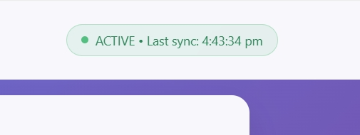

# 🤖 IntelliRAG — AI-Powered Chatbot with Google Drive & Gemini-1.5-flash ✨

A fully **Dockerized** and **Flask-based Retrieval-Augmented Generation (RAG)** chatbot, seamlessly integrating **Google Gemini Pro**, **Qdrant vector database**, and **Google Drive** for intelligent document retrieval.

> 📡 **Live Demo:** [Visit IntelliRAG Chatbot Here](https://intellirag-gdrive-bot16.onrender.com)

---

## 🧠 What IntelliRAG Does

IntelliRAG revolutionizes how you interact with your documents. It's designed to provide precise, AI-generated answers by leveraging your Google Drive content.

* **🔍 Intelligent Query Processing:** Accepts user queries via a sleek web chat interface.
* **📄 Contextual Retrieval:** Retrieves highly relevant information from your **Google Drive** documents using advanced **Qdrant vector search**.
* **🧠 High-Quality Answer Generation:** Feeds the retrieved context to the powerful **Google Gemini-1.5-flash** LLM to synthesize accurate and comprehensive answers.
* **🔄 Effortless Document Sync:** Syncs your Google Drive documents with a **single click** – no manual uploads required!
* **🌐 Seamless Deployment:** Fully deployable via **Docker** on platforms like **Render** or any other cloud service.

---

## ⚙️ Technologies Under the Hood

IntelliRAG is built with a robust and modern tech stack, ensuring performance, scalability, and ease of use.

| Component         | Tech Stack                                                                    |
| :---------------- | :---------------------------------------------------------------------------- |
| **Backend** | Flask (REST API)                                                              |
| **LLM Integration** | Google Gemini-1.5-flash (via Gemini API)                                            |
| **Vector DB** | Qdrant (via Qdrant Cloud API for efficient vector search)                     |
| **Document Loader** | Google Drive API, Langchain, & Unstructured (for diverse document parsing)    |
| **Embedding Model** | `sentence-transformers/paraphrase-MiniLM-L6-v2` (for high-quality embeddings) |
| **Frontend** | HTML, CSS, JavaScript (for an intuitive user interface)                       |
| **Containerization** | Docker (for consistent and isolated environments)                             |
| **Hosting** | Render (for automated and scalable deployments)                               |

---

## 🚀 Get Started: Deploy on Render (Fully Automated)

Deploying IntelliRAG on Render is incredibly straightforward. Follow these steps to get your chatbot up and running in minutes!

1.  **Fork this repository** to your GitHub account.
2.  **Add your secrets** (refer to the `.env` section below for details).
3.  Navigate to [Render](https://render.com/) and click on **"New Web Service."**
4.  Connect your forked repository.
5.  Configure the following settings for your new web service:
    * **Runtime**: `Docker`
    * **Start Command**:
        ```bash
        gunicorn --bind 0.0.0.0:5000 api:app
        ```
    * **Environment**: `Python 3.11`
6.  Render will automatically build and deploy your application. Once deployment is complete, visit your live link and start chatting!

---

## 🔐 Environment Variables (.env or Render Secrets)

Securely configure your application with the following environment variables. On Render, you can add these in the "Environment" tab of your Web Service settings.

| Key                      | Description                                                  |
| :----------------------- | :----------------------------------------------------------- |
| `GOOGLE_DRIVE_TOKEN`     | OAuth token for secure access to your Google Drive.          |
| `QDRANT_API_KEY`         | API key for authenticating with your Qdrant cloud instance. |
| `QDRANT_URL`             | The endpoint URL for your Qdrant vector database.            |
| `GEMINI_API_KEY`         | Your API key for accessing the Google Gemini Pro LLM.        |
| `COLLECTION_NAME`        | The chosen name for your Qdrant collection.                  |

---

## 🧪 Local Development Setup

For local development and testing, follow these steps:

```bash
# Clone the repository
git clone [https://github.com/MICHAEL-MARIA16/INTELLIRAG-GDRIVE_BOT.git](https://github.com/MICHAEL-MARIA16/INTELLIRAG-GDRIVE_BOT.git)
cd intellirag

# Create a Python virtual environment
python -m venv venv
source venv/bin/activate  # On Windows, use `venv\Scripts\activate`

# Install project dependencies
pip install -r requirements.txt

# Run the Flask API locally
python api.py

Visit http://localhost:5000 in your browser to test the application.

## 📦 Docker Support

You can also leverage Docker for a consistent local development experience:

```bash
# Build the Docker image
docker build -t intellirag .

# Run the Docker container, mapping port 5000
docker run -p 5000:5000 intellirag

📁 File Structure Overview
Understanding the project's layout will help you navigate and contribute:

INTELLIRAG/
├── api.py                  # Main Flask API routes and application entry point
├── chatbot.py              # Core RAG chatbot logic and LLM interaction
├── sync.py                 # Handles Google Drive to Qdrant document synchronization
├── drive_loader.py         # Google Drive API integration for document loading
├── qdrant_utils.py         # Qdrant client connection, embedding, and search utilities
├── templates/index.html    # Frontend HTML template for the chat interface
├── static/                 # Contains CSS, JavaScript, and other static assets
├── requirements.txt        # Lists all Python dependencies
├── Dockerfile              # Defines the Docker image build process
└── README.md               # You are here! 🎉
📌 Key Features
IntelliRAG comes packed with powerful features designed for efficiency and intelligence:

✅ Plug-and-play Integration: Seamlessly combines Qdrant, Gemini, and Google Drive.

✅ One-Click Document Sync: Simplifies keeping your vector database up-to-date.

✅ Production-Ready Dockerfile: Ensures consistent deployment across environments.

✅ Gunicorn for Performance: Optimized for high-concurrency Flask serving.

✅ Render-Compatible Deployment: Streamlined for automated cloud hosting.

✅ Modular & Extensible Architecture: Easy to understand, modify, and expand.

📸 Screenshots

**🔹 Chatbot UI**


**🔹 Real-Time Google Drive Sync**


**🔹 Sync Status Confirmation**


📍 Deployment URL
Your live IntelliRAG chatbot is accessible here:

🔗 https://intellirag-gdrive-bot16.onrender.com

💡 Future Enhancements
We're always looking to improve IntelliRAG! Here are some exciting ideas for future development:

🔒 Add Authentication & User Tracking: Implement secure user login and monitor usage.

📈 Include Sync/Usage Stats Dashboard: Provide insights into document synchronization and chatbot activity.

🗂️ Allow Syncing from Other Sources: Expand document ingestion to Dropbox, OneDrive, and more.

🧾 PDF Export for Chat History: Enable users to download their conversation history.

🧑‍💻 Author
Made with ❤️ by Selcii, powered by curiosity and way too much caffeine.

If you find this project useful, please consider giving it a ⭐ on GitHub and sharing your builds!

📝 License
This project is licensed under the MIT License.

Feel free to use, modify, and deploy — just remember to give credit where it’s due.

